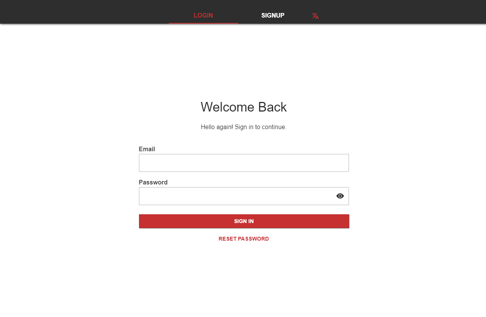
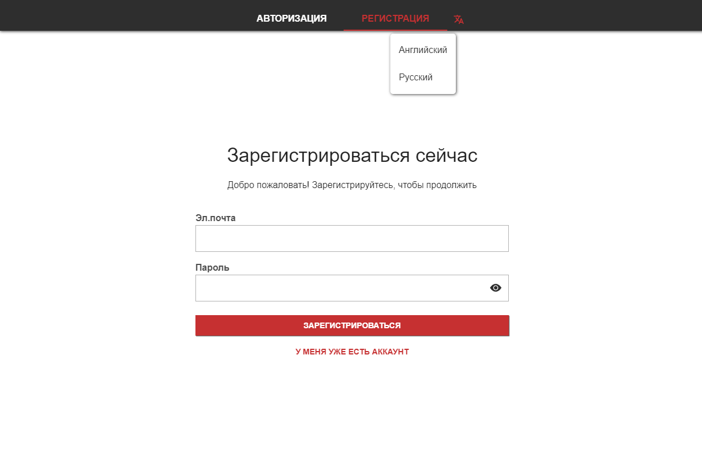
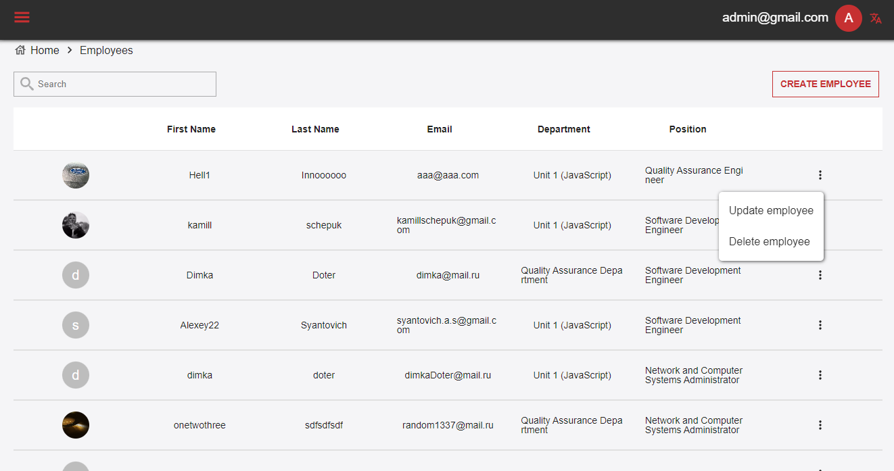
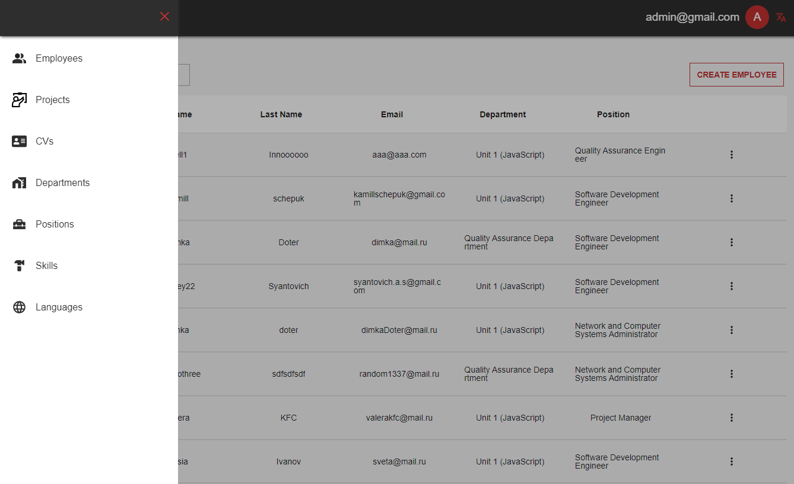
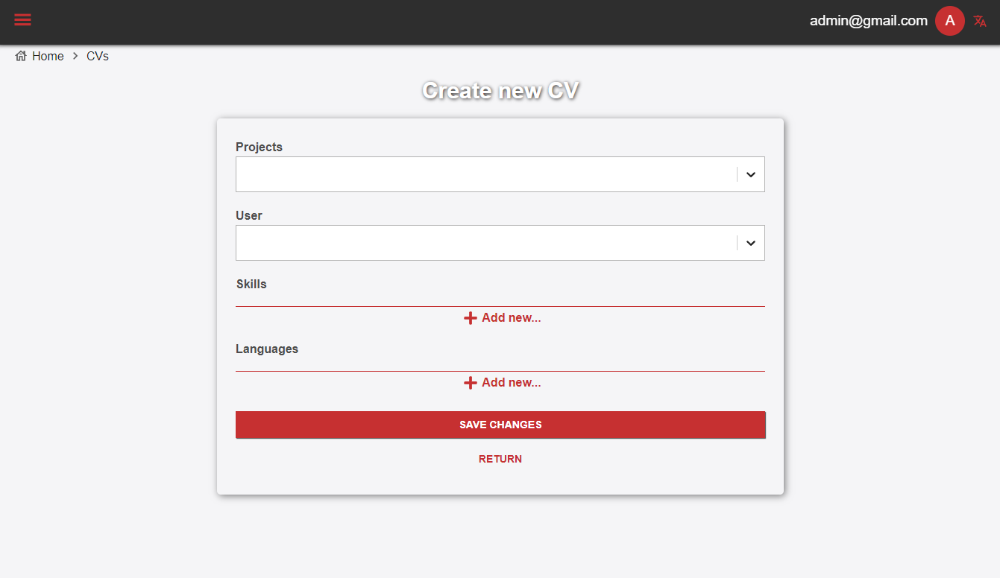
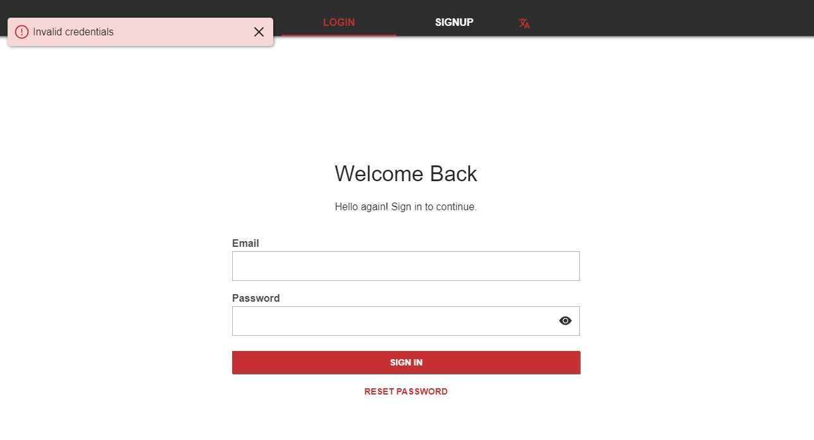
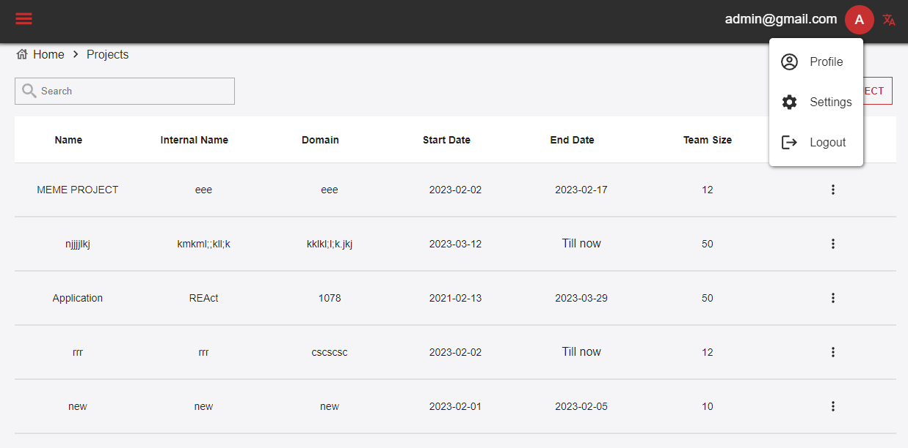
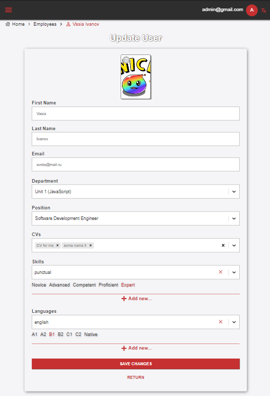

<>
  <h1 align="center">
    
    <a href="https://github.com/VeriSkas/CV" target="_blank">
      Innowise Lab Internship: Level 3: Curriculum Vitae
    </a>
    
  </h1>
  <h3 align="center">
    React Typescript Apollo GrafQL React-router-dom React-hook-form React-select
    SCSS(modules) ESLint Prettier pre-commit hook Webpack alias i18next
  </h3>
  <h2> Task </h2>
  <a
    href="https://innowise-group.atlassian.net/wiki/spaces/~9373156/pages/2617180325/Curriculum+Vitae+Project"
    target="_blank"
  >
    CV task
  </a>
  

  
  

  
  

  
  

  
  
  

  
  

  
  

  
  <h2>How to run the app</h2>
  
Для того, чтобы запустить приложение, нужно:

  <ol>
    <li>Запустить Вашу IDE.</li>
    <li>Открыть нужную папку с приложением CURRICULUM-VITAE</li>
    <li>
      В терминале написать команду npm i, для установки всех настроек и пакетов,
      прописанных в package.json
    </li>
    <li>
      Cделать команду npm start в терминале для запуска приложения в браузере на
      локальном хосте
    </li>
  </ol>
  <h2>Folders structure</h2>
  
Приложение состоит следующих файлов и папок:

  <ol>
    <li>
      <b>.husky</b> - данная папка содержит настройку команды, обеспечивающей
      pre-commit hook
    </li>
    <li>
      <b>public</b> Содержит главный стартовый файл html
    </li>
    <li>
      <b>src</b> Является основной папкой приложения, содержащей весь
      необходимый код, для корректного функционирования приложения. В ней
      содержатся:
    </li>
    <ul>
      <li>папка assets</li>
      <li>папка apollo</li>
      <li>папка components</li>
      <li>папка constants</li>
      <li>папка hooks</li>
      <li>папка i18n</li>
      <li>папка pages</li>
      <li>папка types</li>
      <li>папка utils</li>
      <li> Основные файлы tsx и scss</li>
    </ul>
    <li>
      <b>другие файлы настройки</b>
    </li>
  </ol>
</>;
